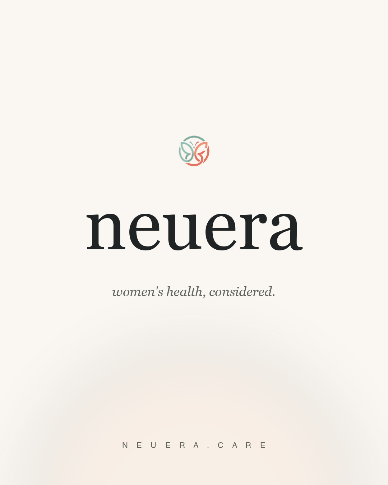
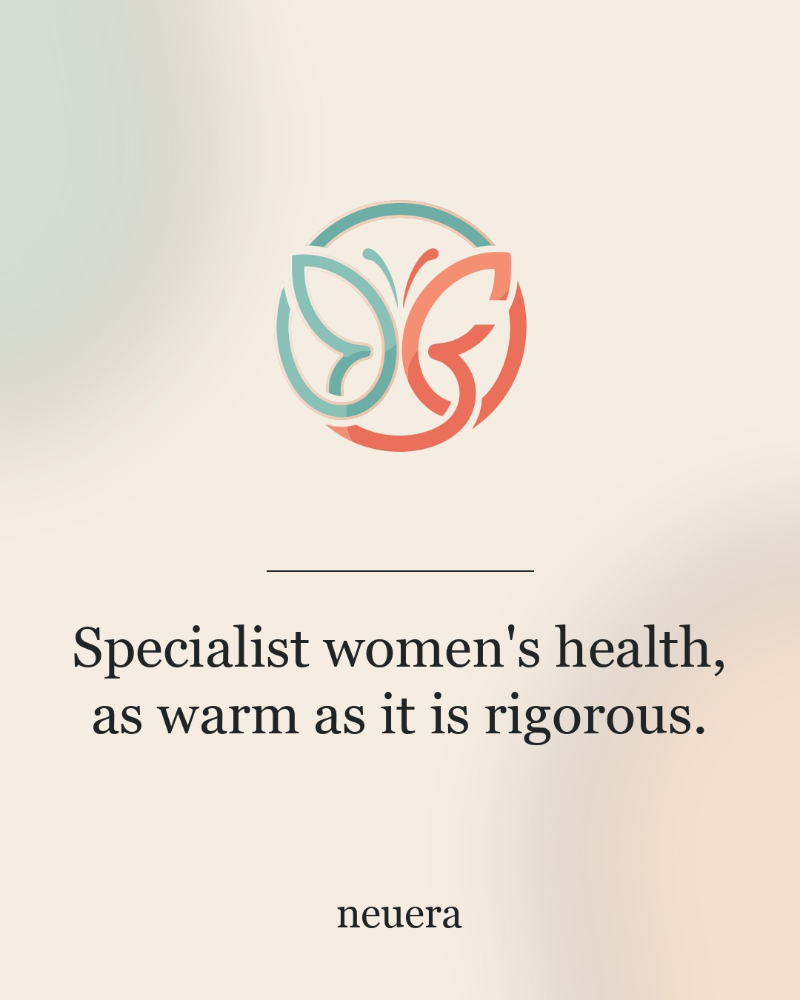
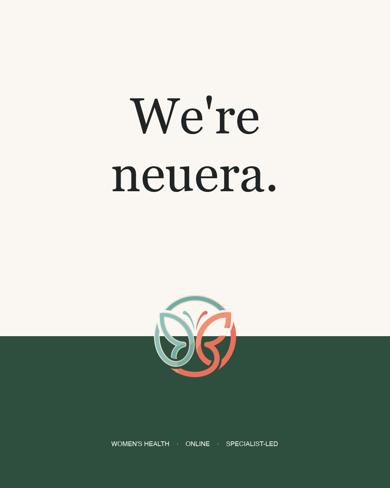
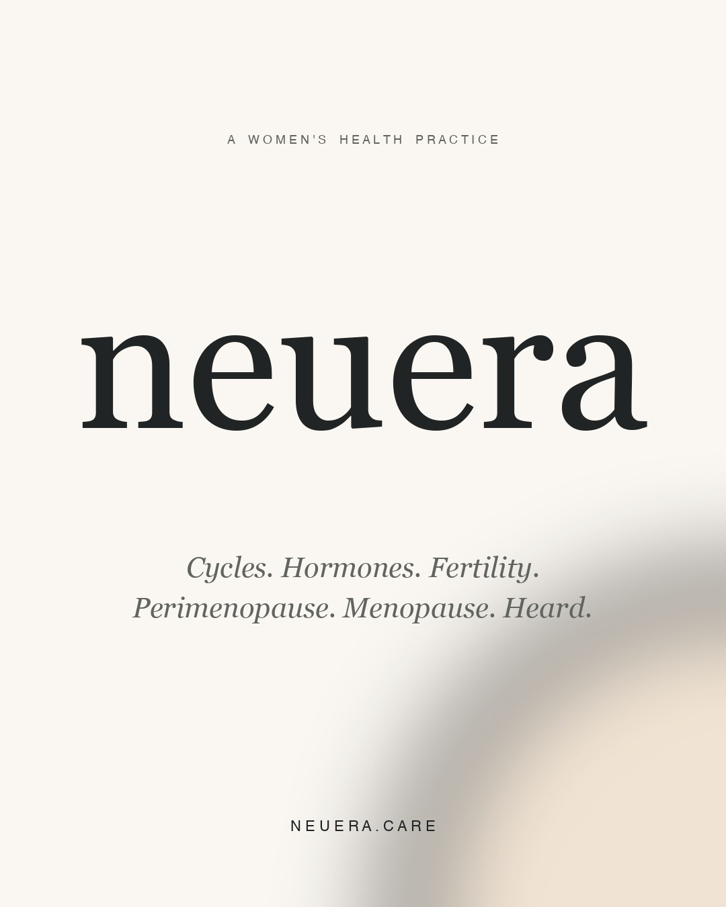

# Post 0 — Brand intro

The first post on the @neuera.care feed. Frames the account, not the
45-day campaign. No countdown, no "launch" badge, no scarcity language —
the brand needs to live on the feed long after this campaign ends, so
this post should age well.

## Captions — pick one

| File | Voice | Hook |
|---|---|---|
| [caption-a.md](./caption-a.md) | Warm direct introduction | "Hi, we're neuera." |
| [caption-b.md](./caption-b.md) | Empathetic advocacy | "For the woman who's been told it's normal." |
| [caption-c.md](./caption-c.md) | Question hook + reframe | "What if your body wasn't the problem?" |
| [caption-d.md](./caption-d.md) | Origin / mission statement | "We started neuera because women's health deserved a different kind of room." |
| [caption-e.md](./caption-e.md) | Short and confident — magazine masthead | "Women's health. Considered." |

## Images — pick one

| File | Direction | Best paired with |
|---|---|---|
|  | **A — Wordmark led, lightest hand.** Big serif "neuera", small logo above, italic tagline. Most restrained. | Caption A or E |
|  | **B — Logo focal + headline.** Big logo, hairline rule, two-line serif sentence. Most directly on-brand. | Caption B or D |
|  | **C — Two-band split.** Cream top, forest band bottom, logo at the seam, "We're neuera." declarative. Boldest. | Caption A or C |
|  | **D — Pure typography.** No imagery. Italic stack of conditions. Reads like a book cover. | Caption D or E |

All four are 1080×1350 JPG, ≤100 KB, validator-compliant. Same brand
palette as the website.

## How to pick

1. **A + E** if you want quiet luxury and trust the typography.
2. **B + D** if you want the most "we're a clinical practice" read — logo central, sentence clinical.
3. **C + A** if you want the loudest opening — declarative, two-color split, ear-catching.
4. **D + E** if you want the post to feel like a magazine cover — text only, italic, no logo.

My pick if you want me to choose for you: **Image A + Caption E**. The
image is the most editorially restrained; the caption is the shortest,
most confident, and most reusable as a brand line going forward.

## Once you pick

Tell me your choices (e.g. "A and E") and I'll:

1. Copy the chosen image to `chosen.jpg` (or just bind the picked file).
2. Update the existing post-0 draft in D1:
   - Replace `accounts/<dummy>/...media` with the chosen image.
   - Replace `drafts.body` with the chosen caption (caption-only, hashtags inline).
   - Replace `drafts.title` with the hook.
3. Reseed the scheduled_for to a sensible "brand intro" slot (probably
   May 19 10:30 IST, one day before the campaign so the feed has an
   anchor post when the daily flow begins).

Or — if you want this to be the very first post and skip the May 19
slot, we can publish it immediately as a smoke test of the full IG
publish pipeline (it's effectively the same call as the future
automated posts).

## Files

```
posts/neuera-care/instagram-launch/0/
├── README.md         ← this file
├── make-images.py    ← regenerator if you want a tweak
├── caption-a.md      ← warm direct intro
├── caption-b.md      ← empathetic advocacy
├── caption-c.md      ← question hook
├── caption-d.md      ← origin / mission
├── caption-e.md      ← magazine masthead
├── image-a.jpg       ← wordmark led
├── image-b.jpg       ← logo focal + headline
├── image-c.jpg       ← two-band split
└── image-d.jpg       ← pure typography
```
